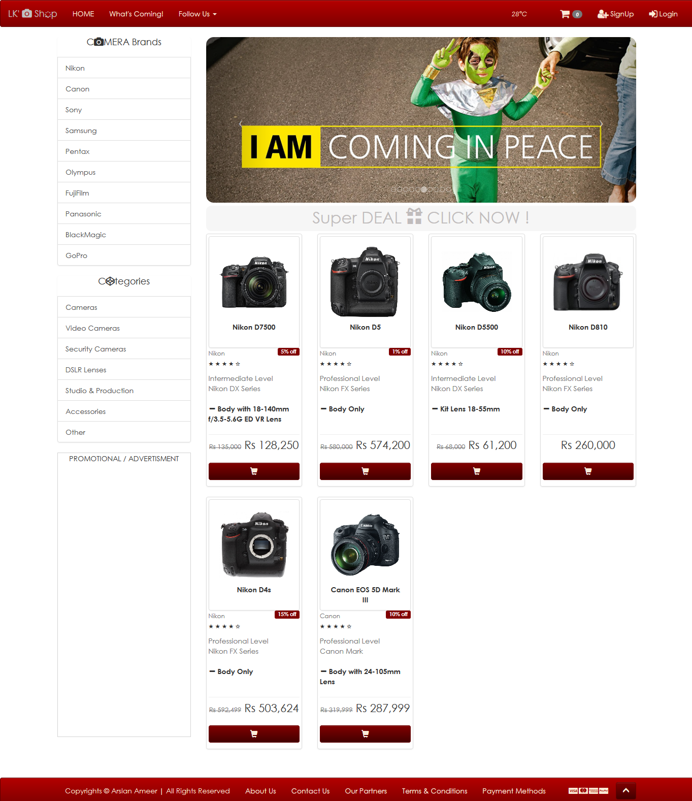
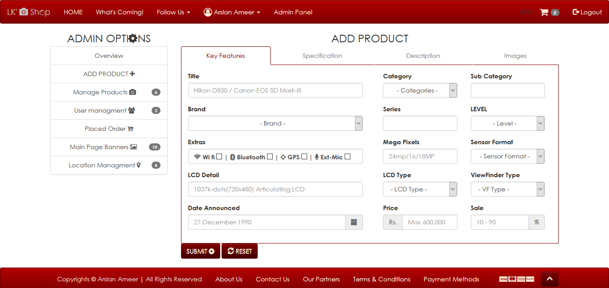

# LK' 📸 shop - eCommerce🛒Site 
   

LK' - 📸Shop an E-Commerce🛒 Site made with Asp.Net MVC Technology using C#, HTML5, CSS3, JavaScript, Bootstrap, JQuery, Ajax, SQL, and EntityFramework.

**_Has:_** Admin panel ⚙ through which one can manage 💻 content of shop like , slider images 🖼 on main page, ➕ add product , 🔧 manage products, 👷‍♂️ manage users, 🌍 manage locations and many more 🎊...

---
### Demo Image 🖼:

---
### Demo in Motion: 😉

# **ITS LIVE. [TRY NOW](http://www.lkeshop.tk/)** 😍

### Demo Admin Panel 🖼:

# **ITS LIVE. [TRY NOW](http://www.lkeshop.tk/)** 😍

## 💡**NOTE :**
This is only a demonstration of my work (an eCommerce Site) & This website is not ready to shop online right now.
some of services like site analytics, traffic tracking, api services are added later (On Demand).

[ © Copyrights Arslan Ameer ]

---
# 🔐LICENSE:
©  Copyright 2018 **Arslan Ameer**

Licensed under the Apache License, Version 2.0 (the "License");
you may not use this file except in compliance with the License.
You may obtain a copy of the License at

    http://www.apache.org/licenses/LICENSE-2.0

Unless required by applicable law or agreed to in writing, software
distributed under the License is distributed on an "AS IS" BASIS,
WITHOUT WARRANTIES OR CONDITIONS OF ANY KIND, either express or implied.
See the License for the specific language governing permissions and
limitations under the License..
